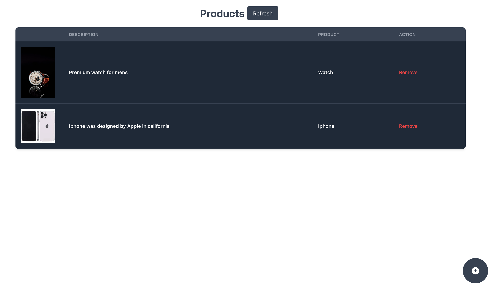

## Simple Product App AWS SAM Template

This AWS SAM (Serverless Application Model) template is designed to create a simple product application consisting of features to create, list, and delete products. The application utilizes AWS services such as DynamoDB for storing product data, Amazon S3 for storing images, AWS Lambda for serverless functions, and Amazon EventBridge for event-driven processing. Below is a detailed documentation of the template in Markdown format.

## The Flow
- All the api's are protected with api key which must be provided at X-Api-Key header
- Once we create a product then the data are populated in dynamo db. 
- The upload image api is different which puts the image in s3 bucket. The put event trigger the event rule which then hits the lambda to optimize the image using sharp as image processor(Image processing dependency is kept in seperate lambda layer).
- While upload the image url is updated in dynamo db table using update query.
- The list api will simply fetch data from dynamo DB.

## Followed some good practices like:
- Principle of mimimum permission to the resource.
- Used API Key for securing api keys, used policy to limit the rates.
- Initialized aws sdk and some heavy dependencies outside the handler.
- Made seperate layer for image processing.
- Used SAM to make serverless app and seamless deployments.
- In FrontEnd used react query to manage and cache api's.
- Used tailwind css to utilize the predefined class.

## About Backend Codebase
I have used node with typescript to implement logic on top of the lambda. This Lambda function serves as the handler for the product application's API Gateway endpoints. It routes incoming requests to appropriate functions for processing and responds accordingly. It also handles events triggered by Amazon S3 uploads, including creating thumbnails of uploaded images. It utilizes AWS SDKs and custom controller functions for various operations.

| **API Endpoint**            | **Method** | **Sample Request**                                                           | **Success Response**                                                                     | **Failure Response**                                                                    |
|-----------------------------|------------|-----------------------------------------------------------------------------|-----------------------------------------------------------------------------------------|------------------------------------------------------------------------------------------|
| `/product`                  | `POST`     | Create a new product with product details and a base64-encoded image         | `{"message": "Product created successfully"}`                                          | `{"message": "Error creating product"}`                                                |
| `/products`                 | `GET`      | Get a list of all products                                                 | Array of product objects                                                               | `{"message": "Error retrieving products"}`                                              |
| `/product/{productId}`      | `DELETE`   | Delete a product by its `productId`                                        | `{"message": "Product deleted successfully"}`                                          | `{"message": "Error deleting product"}`                                                |
| `/product/upload`           | `POST`     | Upload an image for a product with product ID and base64-encoded image       | `{"message": "Product image uploaded successfully", "imageUrl": "..."}`                 | `{"message": "Error:", "error": "..."}`                                                 |
| Event from S3 Upload        | N/A        | Triggered when an image is uploaded to S3                                   | -                                                                                       | -                                                                                        |

## Deployment
- Deploy backend using aws sam, go to root of the project and build using `sam build` and deploy using `sam deploy --guided`

- To deploy FE, checkout [github-repo](https://github.com/abhiyankhanal/Interface) and deploy to github pages

## Postman
- Find the postman collection in the repo.
## Screenshots
### Forbidden UI

### Create Product

### Create Product UI

### Product List UI

### Forbidden UI
